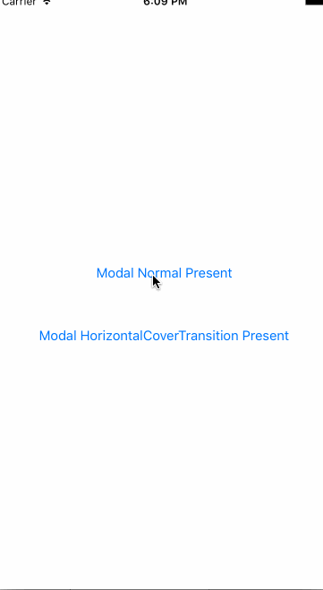

# HorizontalCoverTransitionModalNavigationController
HorizontalCoverTransitionModalNavigationController is an UINavigationController subclass which turns present and dismiss UINavigationController stack like push and pop.

 

